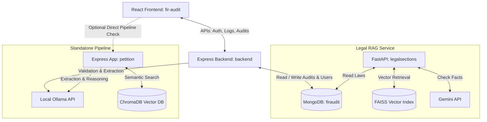

# FIR Audit & Legal Intelligence System Documentation

Welcome to the **FIR Audit & Legal Intelligence** workspace documentation. This system is designed to audit Indian police petitions, validate them against legal criteria, recommend appropriate legal sections from the **Bharatiya Nyaya Sanhita (BNS) 2023** code, and present a premium analytical dashboard to law enforcement officers.

### 📚 Additional Guides
* 🌟 **[System Features & Capabilities Guide](./features.md)** - Explains the user-facing and backend features of the platform.
* 🔄 **[Developer Workflows & Code Map](./workflow.md)** - Details execution sequences, API endpoints, and source file mappings.

---

## 🗺️ System Architecture

The application is structured into four main components working together:

---

## 📂 Component Directory Reference

### 1. [React Frontend (`/fir-audit`)](file:///Users/sadhudinakar/VSCode/fir/fir-audit)
An ultra-premium, dark/light mode supported frontend dashboard tailored for officer engagement.
- **Key Responsibilities**:
  - Authenticating officers via secure HTTP-only cookie-based tokens.
  - Providing custom screens for **FIR Status Boards**, **Active Mistakes / Warning Logs**, **File FIR Wizards**, and **Analytics Charts**.
  - Initiating file scans and showing live step-by-step progress streams.
- **Tech Stack**: React.js (Create React App), Tailwind CSS, React Router DOM, ChartJS.

### 2. [Express Backend (`/backend`)](file:///Users/sadhudinakar/VSCode/fir/backend)
The backend hub managing persistence, sessions, and core pipeline coordination.
- **Key Responsibilities**:
  - Managing JWT tokens, encryption, and route protection middleware.
  - Storing petition audit logs and generated FIR records in MongoDB.
  - Running a streaming 3-stage validation pipeline:
    1. **Text Extraction**: Uses local `llava` vision models for scans, or reads raw text.
    2. **Translation**: Invokes `llama3.2` to translate regional languages to formal English.
    3. **FIR Validation**: Rates petition completeness (Who, What, When, Where) and flags missing fields.
- **Tech Stack**: Node.js, Express.js, MongoDB (Mongoose ODM), Multer, Axios.

### 3. [Standalone Petition pipeline (`/petition`)](file:///Users/sadhudinakar/VSCode/fir/petition)
A microservice hosting a complete 4-stage pipeline incorporating semantic search suggestions.
- **Key Responsibilities**:
  - Processing regional petition uploads.
  - Translating, validating, and searching ChromaDB for matching sections of BNS 2023.
  - Providing helper scripts to parse the official BNS PDF, structure it into JSON, and embed the sections into ChromaDB using Ollama embeddings (`nomic-embed-text`).
- **Tech Stack**: Node.js, Express.js, ChromaDB, Ollama API, PDF extraction libraries.

### 4. [Legal RAG Python API (`/legalsections`)](file:///Users/sadhudinakar/VSCode/fir/legalsections)
A robust Legal Retrieval-Augmented Generation pipeline used to validate applied FIR sections.
- **Key Responsibilities**:
  - Interfacing with MongoDB to load official legal acts (BNS, BNSS, BSA).
  - Building a FAISS vector index using `sentence-transformers` embeddings.
  - Using Google's Gemini SDK (`genai`) with low temperature settings (`0.1`) to check if applied FIR sections match incident facts against retrieved legal definitions.
- **Tech Stack**: Python, FastAPI, FAISS, MongoDB, Sentence-Transformers, Google GenAI SDK.

---

## 🔄 Petition Processing Workflows

The system uses local AI models (via Ollama) and embeddings to analyze petitions. Here is how the processing pipeline operates:

### Standalone 4-Stage Ingestion Pipeline
1. **OCR & Text Extraction**: Parses `.txt` files or runs Ollama `llava` on uploaded images.
2. **Legal translation**: Translates regional Indian dialects into formal English with `llama3.2`.
3. **Legal validation**: Runs compliance checks against the **6 Ws and Hs**. If **Who**, **What**, **When**, or **Where** are absent, the petition is marked invalid, blocking FIR filing until details are filled.
4. **BNS Law Suggestions**: Queries ChromaDB using query embeddings to find the most appropriate legal sections, validating them using `llama3.2` as a legal judge.

### RAG Validation Pipeline (`/legalsections`)
1. **Query Embedding**: The incident fact description is vectorized.
2. **Context Retrieval**: Performs a FAISS vector search combined with exact section matches.
3. **Grounding**: Feeds retrieved legal act sections to Gemini.
4. **Validation Outcome**: Gemini outputs a grounded opinion confirming if the legal ingredients match the case facts.

---

## ⚡ Main API Enpoints

### Express Backend (`/backend`)
- `POST /api/auth/register` - Registers a new law enforcement officer.
- `POST /api/auth/login` - Logs in and issues HTTP-only cookie JWT tokens.
- `GET /api/petitions/draftandfile` - Retrieves valid petitions ready to file.
- `GET /api/petitions/mistakesandwarnings` - Retrieves invalid petitions containing blockers.
- `POST /api/petitions/pipeline` - Streams the 3-stage validation pipeline on file uploads.

### Python Legal RAG (`/legalsections`)
- `POST /ask` - Queries the FAISS index + Gemini for custom legal queries.
- `POST /validate-fir` - Compares incident facts with applied legal sections.
