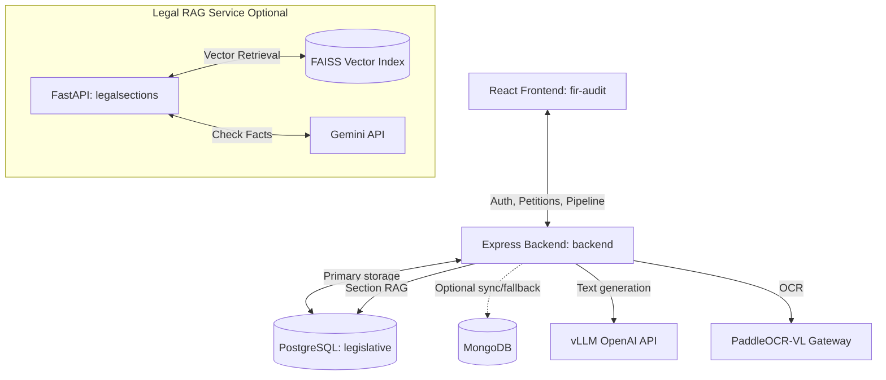

# FIR Audit & Legal Intelligence System Documentation

Welcome to the **FIR Audit & Legal Intelligence** workspace documentation. This system audits Indian police petitions, validates them against legal criteria, recommends appropriate legal sections from the **Bharatiya Nyaya Sanhita (BNS) 2023** code, and presents an analytical dashboard to law enforcement officers.

### Additional Guides

- [System Features & Capabilities Guide](./features.md)
- [Developer Workflows & Code Map](./workflow.md)
- [Setup & Prerequisites Guide](./requirements.md)

---

## System Architecture

---

## Component Directory Reference

### 1. React Frontend (`/fir-audit`)

Officer dashboard with dark/light mode support.

- Authenticates officers via secure HTTP-only cookie JWTs.
- **Check New Petition** — step-by-step pipeline with officer review between OCR, translation, and 5W+1H validation.
- Status boards, blockers feed, FIR filing wizards, analytics charts.
- **Stack:** React (CRA), Tailwind CSS, React Router, Chart.js.

### 2. Express Backend (`/backend`)

Persistence, sessions, and the live petition pipeline.

- JWT auth, petition/FIR CRUD, PostgreSQL primary with optional Mongo sync.
- **4-stage pipeline** (officer can approve each step):
  1. **OCR / extraction** — PaddleOCR-VL (images via chat; PDF/DOCX via `/ocr/extract`).
  2. **Translation** — vLLM (Qwen) to formal English.
  3. **5W+1H validation** — CopWriter-style extract → validate → derive (Who, What, When, Where, Why, How).
  4. **BNS RAG** — PostgreSQL FTS/trigram + BM25 lexical index; auto-selects sections above confidence threshold.
- **Stack:** Node.js, Express, PostgreSQL (`pg`), OpenAI SDK → vLLM, Multer.

### 3. Legal RAG Python API (`/legalsections`) — optional

Standalone FastAPI RAG for validating applied FIR sections against incident facts. Not wired to the live fir-audit UI; the backend uses its own PostgreSQL RAG path.

- **Stack:** Python, FastAPI, FAISS, MongoDB, Sentence-Transformers, Google GenAI SDK.

---

## Petition Processing Workflow

1. **Upload** — Officer selects PDF, image, DOCX, or text file.
2. **Step 1 (OCR)** — Backend extracts raw text; officer reviews and edits if needed.
3. **Step 2 (Translate)** — vLLM translates to English; officer reviews.
4. **Step 3 (5W+1H)** — LLM extracts and validates all six elements; officer approves.
5. **Step 4 (Finalize)** — RAG recommends BNS sections; petition saved to database.

Legacy clients can still call `POST /api/petitions/pipeline` to run all steps automatically with streaming progress.

---

## Main API Endpoints

### Express Backend (`/backend`)

- `POST /api/auth/register`, `/login`, `/logout`, `GET /me`
- `POST /api/petitions/pipeline/step/1` — file upload, OCR
- `POST /api/petitions/pipeline/step/2` — `{ step1Output }`
- `POST /api/petitions/pipeline/step/3` — `{ step2Output }`
- `POST /api/petitions/pipeline/finalize` — RAG + save
- `POST /api/petitions/pipeline` — legacy auto pipeline
- `GET /api/petitions/draftandfile`, `/mistakesandwarnings`, `/counts`, `/analytics`

### Python Legal RAG (`/legalsections`) — optional

- `POST /ask` — FAISS + Gemini legal queries
- `POST /validate-fir` — Compare facts with applied sections
