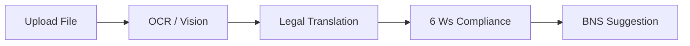

# System Features Guide

This document describes the key features of the **FIR Audit & Legal Intelligence** system, explaining how they work from both a user-facing and backend perspective.

---

## 🔒 1. Officer Authentication & Session Management

To ensure data security and compliance with law enforcement protocols, the system requires all officers to register and log in.

* **How it works**:
  * **Registration & Login**: Officers use [LoginPage.js](file:///Users/sadhudinakar/VSCode/fir/fir-audit/src/pages/LoginPage.js) to register and authenticate.
  * **JWT Cookies**: Upon login, the backend ([auth.js](file:///Users/sadhudinakar/VSCode/fir/backend/routes/auth.js)) issues a JSON Web Token (JWT) stored in a secure, `httpOnly` cookie. This prevents Cross-Site Scripting (XSS) token theft.
  * **Protected Routes**: React router wrappers on the frontend and authorization middlewares on the backend restrict access to authenticated officers.

---

## 📊 2. Officer Dashboard & Analytics

The main landing experience is the Officer Dashboard, providing a high-level view of petition auditing status.

* **How it works**:
  * **Status Summaries**: Displays total processed petitions, filed FIRs, pending drafts, and blocked reports.
  * **Warning Log Feed**: Lists recent petitions flagged as invalid for immediate attention.
  * **Crime Analytics**: Interactive charts using Chart.js on [FIRAnalytics.js](file:///Users/sadhudinakar/VSCode/fir/fir-audit/src/pages/FIRAnalytics.js) show crime trends, geographical distributions, and pipeline ingestion speed metrics.

---

## 📝 3. Petition Ingestion & Validation Pipeline

Officers can upload written or typed petitions to digitize and validate them.

* **OCR & Vision Text Extraction**:
  * Uploaded images (JPEG/PNG) or raw text files are parsed.
  * If it is an image, the backend routes it to the local Ollama `llava` vision model to extract raw handwritten or typed text.
* **Legal Translation**:
  * Since petitions are often written in regional Indian dialects or local vernacular languages, the pipeline uses local `llama3.2` to translate regional content into structured, formal English.
* **Procedural Validation (The 6 Ws)**:
  * The translated text is audited against the legal requirement components (**Who**, **What**, **When**, **Where**, **Why**, **How**).
  * If any core detail is missing (e.g., the date of the incident or name of the accused), the pipeline marks the petition as **Blocked** with warnings.

---

## 🏛️ 4. BNS Legal Recommendations (Standalone ChromaDB)

The standalone petition pipeline suggests BNS (Bharatiya Nyaya Sanhita) 2023 legal section codes for the offense.

* **How it works**:
  * **Vector Database Ingestion**: Official BNS law documents are parsed, divided into chunks, and embedded into a local ChromaDB collection using the `nomic-embed-text` model.
  * **Semantic Recommendation**: When a petition is validated, its English translation is vectorized and matched against the BNS chunks in ChromaDB.
  * **Legal Judge**: The top matching BNS sections are sent to `llama3.2` acting as a legal judge, which selects the most appropriate sections and explains the legal reasoning.

---

## 🔍 5. Legal Retrieval-Augmented Generation (Python RAG API)

For production-level validation, the system includes a Python FastAPI RAG service (`legalsections`) that verifies if applied sections match incident facts.

* **How it works**:
  * **FAISS Indexing**: Legal definitions from BNS, BNSS, and BSA databases are stored in MongoDB and indexed into a local FAISS index using Sentence-Transformers embeddings.
  * **Gemini Grounding**: When validating an FIR, the incident description is matched against the FAISS index. The matching law descriptions and the original incident facts are sent to the Google Gemini API.
  * **Grounded Verdict**: Gemini checks if the ingredients of the law match the facts and responds with a grounded verdict verifying or correcting the applied sections.

---

## ⚠️ 6. Warning Logs & Blockers Feed

Petitions containing missing information are quarantined on the **Blockers Feed** page.

* **How it works**:
  * Displays a card layout listing blocked drafts (e.g. "Missing Accused Name" or "Missing Date/Time of Incident").
  * Officers can view the partial details, consult with the complainants, and edit/complete the missing information directly on the [FIRBlockers.js](file:///Users/sadhudinakar/VSCode/fir/fir-audit/src/pages/FIRBlockers.js) screen. Once updated, the petition undergoes re-validation to be cleared for filing.
