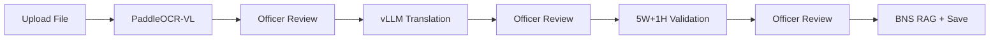

# System Features Guide

Key features of **FIR Audit & Legal Intelligence**, from user and backend perspectives.

---

## 1. Officer Authentication & Session Management

Officers register and log in before accessing petition data.

- **Registration & login** via [LoginPage.js](../fir-audit/src/pages/LoginPage.js).
- **JWT cookies** — backend issues HTTP-only tokens ([auth.js](../backend/routes/auth.js)).
- **Protected routes** on frontend and backend middleware.

---

## 2. Officer Dashboard & Analytics

Status summaries, warning feeds, and crime analytics charts ([FIRAnalytics.js](../fir-audit/src/pages/FIRAnalytics.js)).

---

## 3. Petition Ingestion & Validation Pipeline

Officers upload petitions; each AI step pauses for review before continuing.

- **OCR & extraction** — Images via PaddleOCR-VL chat endpoint; PDF/DOCX via document OCR API. Officer can edit extracted text.
- **Translation** — vLLM translates regional languages (Telugu, Hindi, Tamil, etc.) to formal English. Officer can edit.
- **5W+1H validation** — All six elements required: Who, What, When, Where, Why, How. Missing fields become blockers.
- **Finalize** — PostgreSQL hybrid RAG recommends BNS sections; petition saved with score and blockers.

UI: [FIRAudits.js](../fir-audit/src/pages/FIRAudits.js) — **Check New Petition**.

---

## 4. BNS Legal Recommendations (PostgreSQL RAG)

Live backend RAG in [bnsRagService.js](../backend/services/bnsRagService.js):

- **FTS + trigram** search over `laws_*` tables in PostgreSQL.
- **BM25 lexical index** ([bnsLexicalIndex.js](../backend/services/bnsLexicalIndex.js)).
- **Optional pgvector** when embeddings are ingested (`scripts/ingestLawEmbeddings.js`).
- Sections with confidence ≥ 0.8 are auto-selected into the petition metadata.

Runs in pipeline step 4 (`/pipeline/finalize`) only when 5W+1H validation passes.

---

## 5. Legal Retrieval-Augmented Generation (Python RAG API) — optional

The `legalsections` FastAPI service validates applied sections via FAISS + Gemini. Separate from the live fir-audit pipeline.

---

## 6. Warning Logs & Blockers Feed

Invalid petitions appear on the blockers feed ([FIRBlockers.js](../fir-audit/src/pages/FIRBlockers.js)). Officers can edit missing fields and re-validate.
