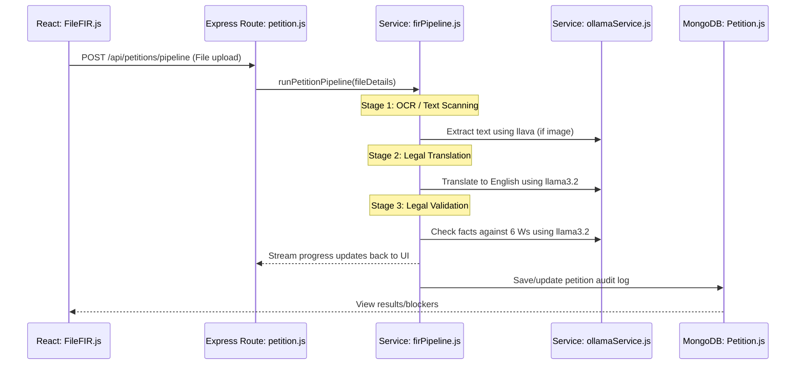
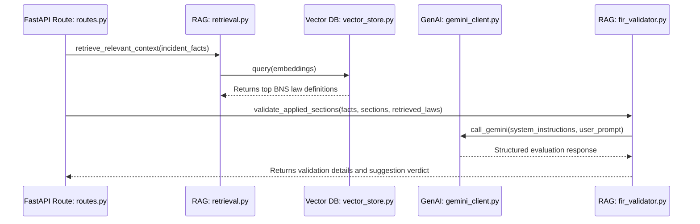
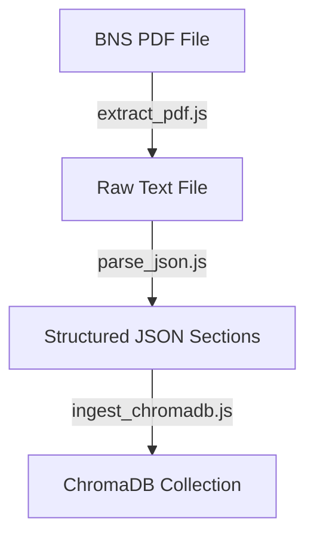

# Developer Workflows & Code Map

This document outlines the step-by-step developer and code pathways for critical flows in the system, mapping frontend actions to specific backend controllers, services, database models, and external APIs.

---

## 🔄 1. Ingestion & Pipeline Validation Flow
This flow is triggered when an officer uploads a raw written petition to scan it for compliance.

### File Map for Ingestion & Pipeline
* **Triggering UI**: [FileFIR.js](file:///Users/sadhudinakar/VSCode/fir/fir-audit/src/pages/FileFIR.js) handles the local file selection and makes an `Axios` multipart request to `/api/petitions/pipeline`.
* **API Entrypoint**: [petition.js](file:///Users/sadhudinakar/VSCode/fir/backend/routes/petition.js) exposes the endpoint, uploads the files to `/uploads` using Multer, and initiates the pipeline run.
* **Pipeline Runner**: [firPipeline.js](file:///Users/sadhudinakar/VSCode/fir/backend/services/firPipeline.js) orchestrates each stage of translation and validation.
* **Local AI Client**: [ollamaService.js](file:///Users/sadhudinakar/VSCode/fir/backend/services/ollamaService.js) formats prompts and performs POST HTTP calls to the local Ollama daemon (port `11434`).
* **Database Representation**: [Petition.js](file:///Users/sadhudinakar/VSCode/fir/backend/models/Petition.js) records the processing status, extracted English translation text, and blocker fields in the `petitions` MongoDB collection.

---

## ⚖️ 2. Legal Section Validation Flow (RAG Service)
This flow checks whether the legal sections applied to the complaint are actually supported by the incident facts, grounding the checks in the vector database of the BNS 2023 code.

### File Map for RAG Validation
* **Python API Entrypoint**: [routes.py](file:///Users/sadhudinakar/VSCode/fir/legalsections/app/api/routes.py) hosts the `POST /validate-fir` endpoint.
* **Text Embeddings Provider**: [embedding.py](file:///Users/sadhudinakar/VSCode/fir/legalsections/app/rag/embedding.py) converts raw queries into high-dimensional vectors.
* **Vector Index Querying**: [vector_store.py](file:///Users/sadhudinakar/VSCode/fir/legalsections/app/rag/vector_store.py) handles context loading and searching in the local FAISS index.
* **Gemini Grounding Client**: [gemini_client.py](file:///Users/sadhudinakar/VSCode/fir/legalsections/app/rag/gemini_client.py) prepares low-temperature prompts referencing law descriptions, sending them to Google's Gemini SDK.
* **Validation & Verdict Engine**: [fir_validator.py](file:///Users/sadhudinakar/VSCode/fir/legalsections/app/rag/fir_validator.py) checks if the facts contain correct "legal ingredients" matching the law.

---

## 📂 3. Ingesting BNS Laws (ChromaDB Vector Store)
For the standalone pipeline, law sections must be loaded and embedded. This flow runs offline to set up the system.

### File Map for Ingestion Scripts
* **PDF OCR/Reader**: [extract_pdf.js](file:///Users/sadhudinakar/VSCode/fir/petition/sections_data/scripts/extract_pdf.js) parses the official BNS Act document into plain text.
* **Text Parser**: [parse_json.js](file:///Users/sadhudinakar/VSCode/fir/petition/sections_data/scripts/parse_json.js) maps the raw text into structured JSON containing section numbers, titles, descriptions, and legal categories.
* **Vector Database Populator**: [ingest_chromadb.js](file:///Users/sadhudinakar/VSCode/fir/petition/sections_data/scripts/ingest_chromadb.js) connects to ChromaDB, generates embeddings using Ollama's `nomic-embed-text`, and stores them.
