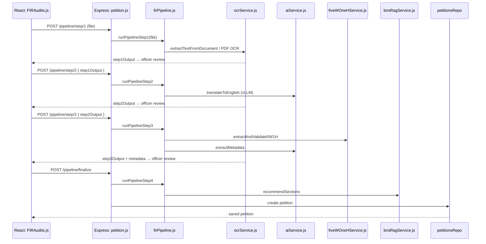

# Developer Workflows & Code Map

Frontend actions mapped to backend controllers, services, and storage.

---

## 1. Step-by-Step Petition Pipeline

Triggered from **Check New Petition** ([FIRAudits.js](../fir-audit/src/pages/FIRAudits.js)).



### File map

| Layer | File |
|-------|------|
| UI | [fir-audit/src/pages/FIRAudits.js](../fir-audit/src/pages/FIRAudits.js) |
| API client | [fir-audit/src/api/petition.js](../fir-audit/src/api/petition.js) |
| Routes | [backend/routes/petition.js](../backend/routes/petition.js) |
| Pipeline | [backend/services/firPipeline.js](../backend/services/firPipeline.js) |
| OCR | [backend/services/ocrService.js](../backend/services/ocrService.js) |
| Text LLM | [backend/services/aiService.js](../backend/services/aiService.js) |
| 5W+1H | [backend/services/fiveWOneHService.js](../backend/services/fiveWOneHService.js) |
| RAG | [backend/services/bnsRagService.js](../backend/services/bnsRagService.js) |
| Storage | [backend/repositories/petitionsRepo.js](../backend/repositories/petitionsRepo.js) |

Legacy auto-run: `POST /api/petitions/pipeline` → `runPetitionPipeline()` with streaming progress.

---

## 2. Legal Section Validation Flow (optional Python RAG)

Separate `legalsections` service — FAISS + Gemini for validating applied sections.

| Layer | File |
|-------|------|
| API | [legalsections/app/api/routes.py](../legalsections/app/api/routes.py) |
| Embeddings | [legalsections/app/rag/embedding.py](../legalsections/app/rag/embedding.py) |
| Vector store | [legalsections/app/rag/vector_store.py](../legalsections/app/rag/vector_store.py) |
| Validator | [legalsections/app/rag/fir_validator.py](../legalsections/app/rag/fir_validator.py) |

---

## 3. BNS Law Corpus (PostgreSQL)

Live RAG reads from PostgreSQL `laws_*` tables. Optional embedding ingest:

```bash
cd backend
npm run db:ingest-embeddings   # requires EMBEDDING_* env + pgvector extension
npm run db:validate-rag
```

Migration/validation scripts live under [backend/db/migrate/](../backend/db/migrate/) and [backend/scripts/](../backend/scripts/).
