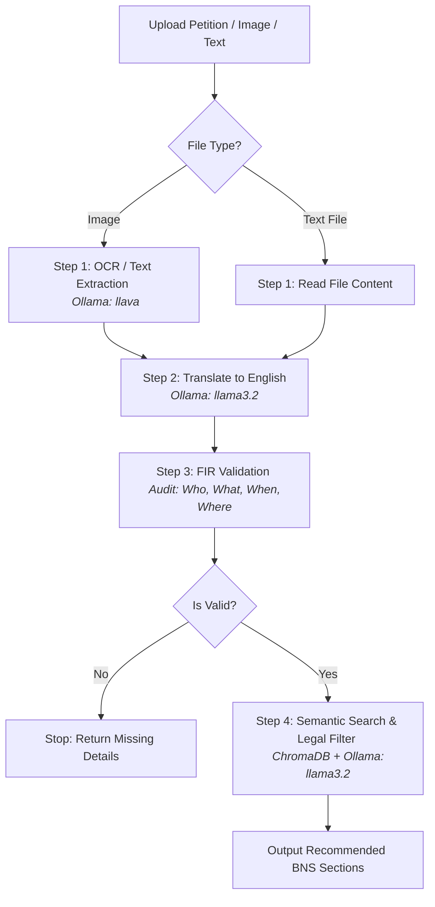

# Standalone Petition Audit AI 🚔⚖️

**FIR Audit AI** is an intelligent assistant microservice designed to audit police petitions and suggest relevant sections of the **Bharatiya Nyaya Sanhita (BNS) 2023** legal code.

This component runs a standalone Express server that orchestrates a complete 4-stage pipeline using local AI models (**Ollama**) and a local vector database (**ChromaDB**). It extracts text from uploaded scanned images, translates regional Indian languages to English, validates incident details, and executes semantic vector searches to recommend laws with detailed justifications.

---

## 🏗️ System Workflow

The application runs a sequential 4-stage pipeline:



### The 4 Stages Explained
1. **OCR / Text Extraction**: Extracts raw text from `.txt` files or scanned images using Ollama's vision model (`llava`).
2. **Translation**: Translates regional Indian languages (e.g. Telugu, Hindi, Tamil, Kannada, Malayalam) into formal English using `llama3.2`.
3. **Legal Validation & Audit**: Checks the petition facts against the core criteria: **Who**, **What**, **When**, and **Where**. If any are missing, it flags the petition as invalid and outlines what needs correction.
4. **BNS Law Suggestions**: Generates text embeddings using Ollama's `nomic-embed-text`, searches ChromaDB for matching sections of BNS 2023, and queries `llama3.2` as a legal judge to suggest the 3 most relevant laws with clear reasoning.

---

## 📁 Ingestion Scripts (ChromaDB)

The files inside `sections_data/` and its `scripts/` folder are used to build and populate your ChromaDB vector database:

- **`extract_pdf.js`**: Extracts the raw text from `BNS2023.pdf` and outputs it to `BNS2023_raw.txt`.
- **`parse_json.js`**: Parses raw text sections into structured JSON elements in `bns_sections.json` containing section numbers, titles, and body content.
- **`ingest_chromadb.js`**: Loads `bns_sections.json`, creates embeddings for each section using Ollama `nomic-embed-text`, and stores them in ChromaDB.
- **`test_search.js`**: A quick utility to verify database connectivity and retrieve test queries.

---

## ⚡ API Documentation

| Endpoint | Method | Description |
| :--- | :--- | :--- |
| `/upload` | `POST` | Upload and stage multiple files in `/uploads` |
| `/api/ollama/text` | `POST` | Query local text models (`llama3.2`) |
| `/api/ollama/vision` | `POST` | Query local vision models (`llava`) with images |
| `/api/firpipeline` | `POST` | Run and stream the step-by-step 4-stage FIR validation pipeline |

---

## 🚀 Setup & Execution

### 1. Prerequisites
Ensure **Ollama** is running locally on port `11434` and **ChromaDB** is running on port `8000`.

### 2. Configure Environment Variables
Create a `.env` file in the `petition` root directory:

```env
PORT=3002
OLLAMA_URL=http://localhost:11434
```

> [!WARNING]
> By default, the React frontend (`fir-audit`) runs on port `3000`. If you wish to run both concurrently, make sure to change the `PORT` in the petition's `.env` to `3002` (or another unused port) to avoid port conflicts.

### 3. Initialize and Start
Run the following commands:

- **Install dependencies**:
  ```bash
  npm install
  ```

- **Ingest BNS Data (First time setup)**:
  ```bash
  node sections_data/scripts/ingest_chromadb.js
  ```

- **Run Server in Development Mode**:
  ```bash
  npm run dev
  ```

- **Run Server in Production Mode**:
  ```bash
  npm start
  ```

---

## 📘 Central Documentation

For comprehensive system workflows and setup guides, refer to:
- 📖 [doc/doc.md](file:///Users/sadhudinakar/VSCode/fir/doc/doc.md) - System Architecture & Pipelines
- 🔧 [doc/requirements.md](file:///Users/sadhudinakar/VSCode/fir/doc/requirements.md) - Setup & installation guides
