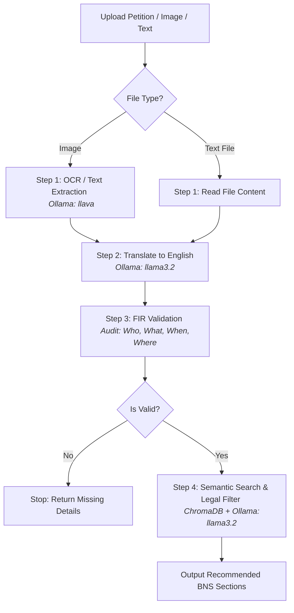

# FIR Audit AI 🚔⚖️

**FIR Audit AI** is an intelligent assistant designed to audit police petitions and suggest relevant sections of the **Bharatiya Nyaya Sanhita (BNS) 2023** legal code. 

It uses local AI models (**Ollama**) and a vector database (**ChromaDB**) to extract text from files or images, translate them to English, validate key details, and recommend matching laws with detailed justifications.

---

## 🏗️ System Workflow

The application operates as a sequential 4-stage pipeline:



### The 4 Stages Explained
1. **OCR / Text Extraction**: Extracts text directly from `.txt` files or scanned petition images using the Ollama Vision model (`llava`).
2. **Translation**: Automatically translates Indian regional languages (e.g. Telugu, Hindi, Tamil, Kannada, Malayalam) into formal English using `llama3.2`.
3. **Legal Validation & Audit**: Validates the petition against the **6 Ws & Hs** (Who, What, When, Where, Why, How). The petition is flagged as **Invalid** if any of the core details (**Who, What, When, Where**) are missing.
4. **BNS Law Suggestions**: Generates query embeddings with `nomic-embed-text`, searches ChromaDB for matching sections of BNS 2023, and uses `llama3.2` as a legal judge to suggest the 3 most relevant sections, verifying the legal ingredients match the case facts.

---

## 🛠️ Prerequisites & Setup

### 1. Requirements
Ensure the following are installed and running on your local machine:
* **Node.js** (v18 or higher)
* **Ollama** (Running locally on `http://localhost:11434`)
* **ChromaDB** (Running locally on `http://localhost:8000`)

### 2. Download AI Models
Run these commands in your terminal to download the required models:
```bash
ollama pull llama3.2
ollama pull llava
ollama pull nomic-embed-text
```

### 3. Project Configuration
1. Clone or download this project.
2. In the root directory, install npm dependencies:
   ```bash
   npm install
   ```
3. Create a `.env` file in the root directory (or edit the existing one):
   ```env
   PORT=3000
   OLLAMA_URL=http://localhost:11434
   ```

---

## 📂 Project Structure & Database Utilities

Here is an overview of the key folders and files in the project.

```
├── index.js               # Main Express.js server config and routes
├── ollamaService.js       # Wrappers for Ollama (Text, Vision, Embeddings)
├── pipelines/
│   └── firPipeline.js     # Code orchestrating the 4-step processing pipeline
├── services/
│   └── bnsSearch.js       # Core semantic search querying ChromaDB
├── public/                # Frontend dashboard interface
│   ├── index.html         # Main dashboard HTML
│   └── samples/           # Ready-to-use valid & invalid test petitions
└── sections_data/         # BNS raw files and ingestion scripts
    ├── BNS2023.pdf        # Official BNS PDF document
    ├── BNS2023_raw.txt    # Extracted text format
    ├── bns_sections.json  # Parsed JSON sections
    └── scripts/           # Ingestion utilities (See details below)
```

<details>
<summary>📂 Click to expand BNS Ingestion Scripts details</summary>

The scripts in `sections_data/scripts/` are used to build and populate your ChromaDB vector database:

1. **`extract_pdf.js`**:
   Extracts text content from the BNS PDF and outputs it to `BNS2023_raw.txt`.
   ```bash
   node sections_data/scripts/extract_pdf.js
   ```
2. **`parse_json.js`**:
   Parses raw text into structured JSON sections `bns_sections.json` containing section numbers, titles, and body content.
   ```bash
   node sections_data/scripts/parse_json.js
   ```
3. **`ingest_chromadb.js`**:
   Reads `bns_sections.json`, creates embeddings for each section using Ollama `nomic-embed-text`, and stores them in ChromaDB under the collection name `bns_collection`.
   ```bash
   node sections_data/scripts/ingest_chromadb.js
   ```
4. **`test_search.js`**:
   Allows you to test if the database is running and returning matches.
   ```bash
   node sections_data/scripts/test_search.js
   ```

</details>

---

## 🚀 Running the Application

### 1. Ingest BNS Data
Make sure ChromaDB is running on port `8000`, then import the BNS laws into the database:
```bash
node sections_data/scripts/ingest_chromadb.js
```

### 2. Start the Server
* **Development Mode** (auto-reloads on file changes):
  ```bash
  npm run dev
  ```
* **Production Mode**:
  ```bash
  npm start
  ```

Open **[http://localhost:3000](http://localhost:3000)** in your web browser to run audits and view results!

---

## 🔌 API Documentation

| Endpoint | Method | Description |
| :--- | :--- | :--- |
| `/upload` | `POST` | Upload and stage multiple files in `/uploads` |
| `/api/ollama/text` | `POST` | Query local text models (`llama3.2`) |
| `/api/ollama/vision` | `POST` | Query local vision models (`llava`) with images |
| `/api/firpipeline` | `POST` | Run and stream the step-by-step FIR validation pipeline |

<details>
<summary>🔌 Click to expand API Payload & Response specifications</summary>

### 1. Run FIR Pipeline (Streaming)
Runs the sequential 4-step pipeline on an uploaded file.
* **URL**: `/api/firpipeline`
* **Method**: `POST`
* **Content-Type**: `multipart/form-data`
* **Body**: `image` (single `.txt` or image file)
* **Response**: Streamed NDJSON (`application/x-ndjson`). Example chunk outputs:
  ```json
  {"type": "progress", "message": "--- Step 1: Extract Raw Text Started ---"}
  {"type": "progress", "message": "--- Step 2: Translate to English Started ---"}
  {"type": "result", "data": { "valid": true, "reason": "...", "response": "translated text", "bnsResults": { "sections": [...] } }}
  ```

### 2. General Text Prompt
* **URL**: `/api/ollama/text`
* **Method**: `POST`
* **Request Body**:
  ```json
  {
    "prompt": "What is the penalty for theft under BNS?",
    "model": "llama3.2"
  }
  ```
* **Response**:
  ```json
  {
    "success": true,
    "response": "..."
  }
  ```

### 3. General Vision Prompt
* **URL**: `/api/ollama/vision`
* **Method**: `POST`
* **Request Body**:
  ```json
  {
    "prompt": "Identify any written text in this image.",
    "model": "llava",
    "images": ["/9j/4AAQSkZJRgABAQEASABIAAD..."] // Array of base64 strings
  }
  ```
* **Response**:
  ```json
  {
    "success": true,
    "response": "..."
  }
  ```

</details>
